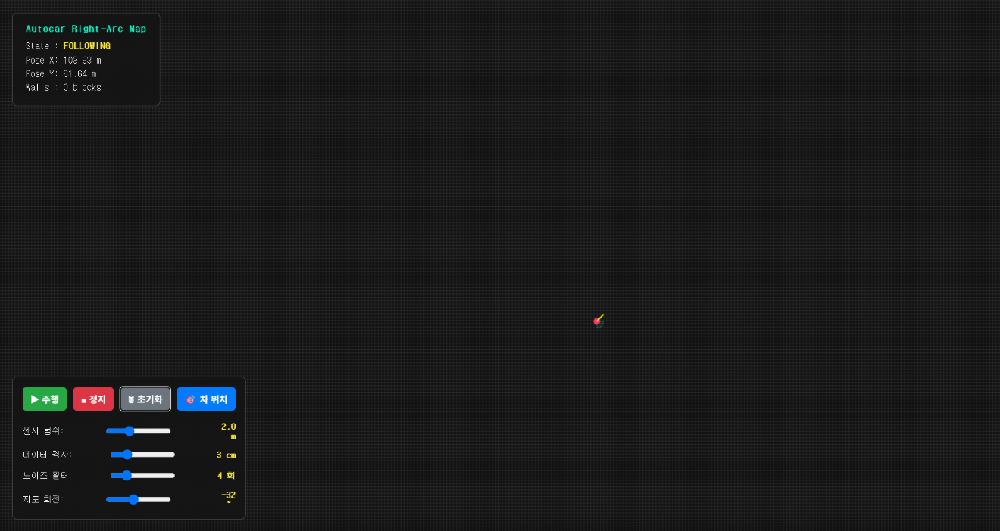

**MD설명**
* DEVELOP_LOG : 개발 기간동안 진행된 개발 일정
* PLAN : 개발계획서
* TECH : 기술서

**폴더설명**
* collision_dataset : 카메라 이미지 학습에 쓰인 데이터셋
* move_car : 차량 자동 주행코드
* train_model : 데이터셋으로 모델을 학습시키는 코드

RPLiDAR를 사용해 탐색가능한 공간이 있을 때 이 공간을 2차원 평면도의 지도로 만들어 주는 기능을 제작하고자함  
현재 시작위치를 중심으로 지도를 그려나가는 방식  
벽을 찾고 오른쪽 벽을 따라서 주행한다.  

