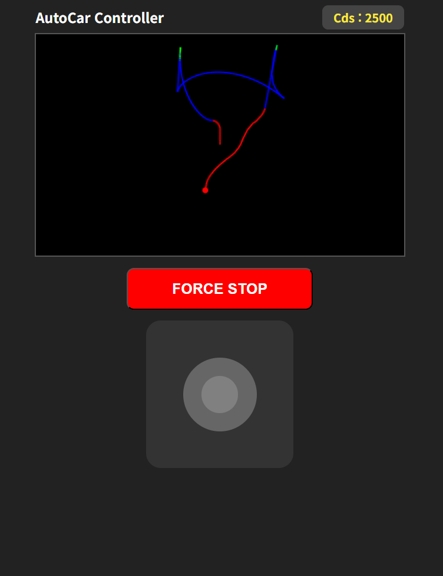

0703, 0706~0707 실시한 코드작  
목표 : 운동장의 트랙을 한바퀴 돌면서 CDS 센서 데이터를 수집하고, 수집한 데이터를 그래프로 시각화하여 분석한다.  
CDS 센서 데이터의 컬럼으로 autocar 의 위치 정보를 같이 수집한다.  
위치 정보는 모터의 움직임과 앞바퀴의 각도로 추정하여 수집한다.(카메라의 영상으로 visual odometry를 구현하여 위치를 추정하는 방법도 있음)  
수집 활동 하는 사진 찍어서 시트에 올릴것  
webview 대시보드에서 센서 데이터 수집 및 시각화 기능 구현( 운동장의 위치별 센서 데이터 수집 및 시각화)  
수집 활동 하기 전에 이동 프로그램을 생각해서 만들고, 수집(수동으로 조작 해도 됨)  
수집 한 데이터는 csv 파일로 저장  

moving_visual.py  
코드를 시작하면 오토카 전면, 후면의 LED점등. 코드 종료시 LED도 꺼진다.  
상단 사각형 영역에 오토카의 움직임을 모터의 속도, 조향각도, 자이로센서, 조이스틱의 위치 등을 고려하여 출발지점(사각형 원점)에서 이동하는 모습을 그린다.  
조이스틱으로 오토카를 조작한다.  
가운데의 발간 버튼은 오토카를 강제로 멈추는 버튼이다.  

cds_moving_visual.py  
이전 기능에 화면 우측상단에 현재 cds값을 출력한다.  
cds값에 따라 기존 하얀색으로 그렸던 라인의 색을 다르게 그린다.  
800이하 : 파란색  
800~1800 : 초록색  
1800이상 : 빨간색  

save_csv.py
이전 기능에 오토카의 상대적인 좌표(x,y)와 그떄 cds값을 csv로 저장한다.  
저장되는 파일명 : autocar_log_{코드 실행시간}.csv  

